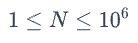
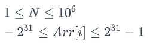
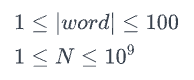

#Първо Домашно:

##Зад 1.

####**Първо контролно**

За първото контролно професор ЧЧ е решил да разположи всички участници в една редица един зад друг. Всеки участник е получил един вариант на контролното. За жалост един участник, Коцето, е закъснял. ЧЧ има точно един останал вариант на контролното и се чуди къде да разпожи Коцето, така че да е най-далеч от останалите участници със същия вариант. За да помогнете на ЧЧ трябва за всеки участник да кажете какво е най-малкото разстояние от него до най-близкия участник с варианта на Коцето.

**Input Format**

За улеснение вариантите ще са малки букви от латинската азбука.

На първият ред ще получите 1 дума представляваща последователност от вариантите на всички участници един след друг. Думата ще има *`N`* на брой символа.

На втория ред ще получите един символ - варианта, който е останал за Коцето.

**Constraints**



**Output Format**

На един ред изведете разделени с празно място (спейс) разстоянията на всеки един участник до най-близкия вариант, който получава Коцето. Резултата трябва да е в същата наредба, в която са зададени участниците на входа.

**Sample Input 0**

```
abaaa
b
```

**Sample Output 0**

```
1 0 1 2 3
```

**Explanation 0**

На входа сме получили 2 различни варианта - `a` и `b`. Като първият участник има вариант , вторият - вариант  и тн. Интересуваме се на какво разстояние е всеки участник от някой с вариант `b`.

Участниците с вариант `b` са на рзстояние `0` от участници с вариант `b`.

Участниците непосредствено от ляво и от дясно (отпред и отзад) на участника с вариант `b` са на разстояние `1` и тн.

Най-десния участник (последното ) е на разстояние `3` от участника с ваирант `b`.

Коментар: Следователно, ЧЧ ще избере да сложи Коцето най-дясно на редицата. ВАЖНО!!! - Това не е необходимо да го съобразявате вие, единствено е необходимо да изчислите кой на какво разстояние е от участник с варианта, който Коцето има.

**Sample Input 1**
```
abaaabcdc
b
```
**Sample Output 1**
```
1 0 1 2 1 0 1 2 3
```
**Explanation 1**

Този път имаме двама участници с вариант `b` и съответно те са на разстояние `0`. Тримата участници с вариант `b` един до друг са между два варианта  и следователно имат стойности `1 2 3`.


-----------------------

##Зад.2

####**Футболен отбор**

Разполагате с информация за футболен клуб и по-конкретно поредица от номера на екипите на всички футболисти, които са играли някога за този отбор. Възможно е да срещате повтарящи се номера, това е защото в даден момент футболист е играл с номер Х и след напускането му друг футболист е започнал да играе със същия номер Х. Вашата задача е да намерите най-малкият номер на екип(цяло положително число), който никога не е слаган на екипа на футболист от отбора. Тъй като информацията е писана преди време, трябва да внимавате с това че може да срещнете отрицателни числа(които не трябва да вземате под внимание) между номерата на екипите.

**Input Format**

На първия ред на стандартния вход ви е дадено положително число N. На втория ред - са дадени N на брой цели числа `Arr[i]`

Constraints



**Output Format**

На първия и единствен ред на стандартния изход трябва да изведете търсеният първи липсващ номер на екип.

**Sample Input 0**

```
15
9 2 6 5 -1 1 4 -20 3 2 2 1 -8 -7 -5
```

**Sample Output 0**
```
7
```
**Explanation 0**

Първият номер, който не е използваn за екип на футболист на отбора е 7

**Sample Input 1**

```
4
1 5 4 3
```

**Sample Output 1**

```
2
```

------------

##Зад.3

####**Уроци по английски**

Мими ходила на частни уроци по английски и математика при една и съща учителка. По математика се справяла добре, но имала затрудения с ученето на нови думи по английски. Учителката, за да помогне на Мими започнала да и дава за домашно дълги думи и съответно число за всяка дума като нейната задача е да пише последователно символ по символ от думата толкова пъти колкото е числото(като изпише цялата дума започва отначало да я пише). Вашата задача е по дадени дума и число от госпожата да кажете колко пъти се среща символа S в написаното от Мими домашно

**Input Format**

На първия ред на стандартния вход ви е дадена дума word(символен низ, който съдържа главни и малки латински букви), на втория ред цяло число N, което показва броя на символите, които Мими трябва да напише На последения ред е даден символ S, чийто брой срещания трябва да намерите в написаното от Мими домашно

**Constraints**



**Output Format**

На първия и единствен ред на стандартния изход трябва да изведете цяло число, отговарящо на брой срещания на символа S в написаното от Мими домашно.

**Sample Input 0**

```
SDA
11
D
```

**Sample Output 0**

```
4
```


**Explanation 0**

Домашното на Мими е да напише 11 символа, което означава, че ще изпише цялата дума "SDA" точно три пъти и първите два символа от нея: SDA SDA SDA SD Ще търсим броя срещания на символа 'D' в домашното на Мими. Символът се среща точно 4ри пъти

**Sample Input 1**

```
foo
2
x
```

**Sample Output 1**

```
0
```

**Explanation 1**

Домашното на Мими: fo Броят срещания на символа 'x' в него е точно 0.
