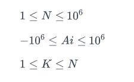
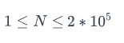
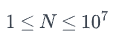
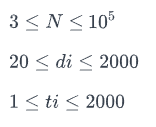

# Второ домашно

## Зад 1.

#### Евтини подаръци

 ###### *Бележка: за тази задача не е разрешено използването на вградени алгоритми и стурктури от данни (различни от вектор)*

Както знаете, Скрудж е малко стиснат. Въпреки това, ако не подари на служителите си някакви подаръци за Коледа, синдикатите ще го погнат, а служителите - ще напуснат. А това не е добре за бизнеса.

Асистентката на Скрудж му е подготвила списък с възможни подаръци. Той има точно K на борй скужителя. Помогнете му да разбере каква е най-малката възможна сума, която трябва да похарчи, за да може всеки служител да има подарък

**Input Format**

На първия ред на стандартния вход ще получите число N - броят възможни подаръци.

На втория ред на стандартния вход ще получите N на брой цели числа Ai - цената на всеки един от възможните подаръци.

На последния ред на входа ще получите число K - броят на служителите на Скрудж.

**Constraints**


  
**Output Format**

На единствения ред на стандартния изход изведете каква е минималаната сума, която Скруж трябва да плати, за да има подаръци за всичките му служители.

**Sample Input 0**

```
6
3 7 -4 11 9 1
4
```

**Sample Output 0**

```
7
```

--------

## Зад 2.

#### Logging, monitoring, alerting

Разполагате с логове от критична система. За съжаление, времената на логовете са се разбъркали. Вашата задача е да укажете правилния ред на всички записани логове.

**Input Format**

На първият ред на стандартния вход получавате цяло число N.

На следващите N реда прочитате N на брой timestamp-a.

Всеки timestamp е във формат HH:MM:SS DD.MM.YYYY

**Constraints**

 

**Output Format**

На N реда в стандартния изход изведете правилната подредба на логовете, започвайки от този, който е най-рано във времето. Използвайте индексите им от входа, като логовете са номерирани от 1 до N.

**Sample Input 0**

```
4
22:44:05 11.04.2021
13:12:21 31.08.2017
10:41:28 23.10.2021
08:00:45 08.01.2016
```

**Sample Output 0**

```
4
2
1
3
```

--------------

## Зад 3.

#### Отбор за милиони

Пешо играе фентъзи футбол за първи път. Тъй като не е много навътре в отборите от Висшата лига, той трябва да избере кои играчи да използва за отбора си. Също така, общо играчите там са стотици, а Пешо не може да помни чак толкова имена, затова е подбрал 62ма от играчите.

За него е важно да знае кой от тях колко активен е по време на мачовете. Затова, всеки път когато някой от играчите играе с топката, Пешо записва номера му. За да може да види кой колко често играе, той трябва да разполага с лесна за обработка информация. Например, последователността от числа може да бъде сортирана. Така на него ще му е много по-лесно да вземе решение кого да включи в отбора си. Помогнете на Пешо да стане шампион.

**Input Format**

На първия ред на стандартния вход ще получите число N, указващо броя номера.

На втория ред на стандартния вход се прочитат N на брой положителни числа Ai. Всяко число Ai е не по-голямо от 62.

Числата са закодирани по следния начин:

1-10 => '0' – '9'

11-36 => 'a' – 'z'

37-62 => 'A' – 'Z'

**Constraints**

    

**Output Format**

На единствения ред на стандартния изход изведете сортираната последователност.

**Sample Input 0**

```
20
Abcabc12345ABCDE1234
```

**Sample Output 0**

```
112233445abbccAABCDE
```

---------------------

## Зад 4.

#### Добрите момчета от залите

Добрите момчета от залите не могат да устяновят кой от тях е най-ефективен в пренасянето на тежести от лежанката към "мъртвата тяга". Уменията за пренасяне на всеки се характеризират с 2 параметъра: Какъв е диаметъра d на тежестите, които може да пренася и какво време t му отнема за това. Тежестите се различават единствено в диаметъра си, дебелината на всички е еднаква. Всеки от тях може да пренася само този един вид тежести (такава му е тренировъчната програма все пак).

Приемете, че времето между две пренасяния на тежести е равно на 0. Приемете и че всеки винаги прави целочислен брой курсове.

Тежестите са кръгли, с еднаква дебелина, плътност и материали. Единствената разлика е в диаметъра им d.

Решете спора в залата като им кажете кой от тях е най-ефективен (може да пренесе тежести с най-голяма обща маса за определено време).

**Input Format**

На първия ред на стандартния вход е зададени число N, което показва броя на добрите момчета в залата.

Следват N реда, като на всеки ред е зададена двойка числа - диаметърът di на тежестите, които всеки може да носи и времето ti, за които прави един курс. Няма двама, при които и двете характеристики да са равни.

**Constraints**

    

**Output Format**

На единствения ред на стандартния изход изведете индексите на момчетата в намаляващ ред по ефективност. Ако двама от тях са с еднаква ефективност - първо изведете този, който може да носи тежести с по-голям диаметър. Всеки два индекса са разделени точно с един интервал. Индексите са номерирани от 1 до N.

**Sample Input 0**

```
3
90 1
20 2
110 2
```

**Sample Output 0**

```
1 3 2
```