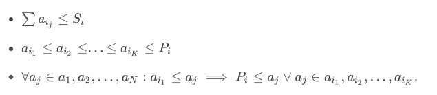
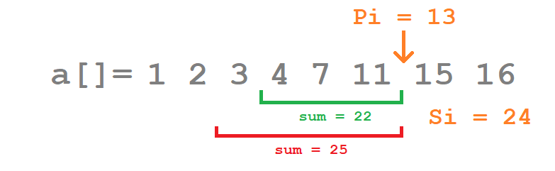
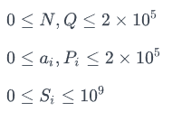
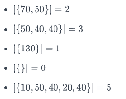

# Зад 4.

## Weird Queries

Дадена ви е редица от **_N_** цели числа: **_a1, a2, ... , aN_** . Вие трябва да отговорите на **_Q_** заявки от вида:

По дадени две цели числа **_Si_** и **_Pi_** намерете броят на числата в подредицата **_ai1, ai2, ... , aiK_** , за която е изпълнено че:



По-просто казано, ако всеки път избирате най-голямото не превишаващо **_Pi_** число, докато сумата на избраните числа не превишава **_Si_** и спрете да взимате числа ако не можете да изберете поредното най-голямо, колко числа ще изберете?



**Input Format**

Първият ред на стандартният вход се съдържа две числа **_N_** и **_Q_** - броят на елементите в редицата и броят заявки.

Следващият ред съдържа **_N_** на брой цели числа **_ai_** - елментите на редицата.

Следващите **_Q_** на брой реда съдържат по две цяли числа **_Si_** и **_Pi_** - числата от заявката.

**Constraints**



**Output Format**

Изведете **_Q_** на брой реда с по едно число - отговора на поредната заявка.

**Sample Input 0**

```
7 5
70 10 130 50 40 20 40
150 100
140 50
190 130
60 80
300 60
```

**Sample Output 0**

```
2
3
1
0
5
```

**Explanation 0**

_Отговорите се получават чрез избиране на следните числа_:



