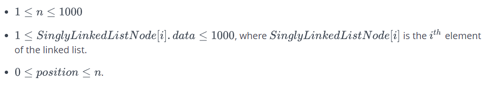

# Зад 1.

## Insert a node at a specific position in a linked list

###### *This challenge is part of a tutorial track by [MyCodeSchool](https://www.youtube.com/user/mycodeschool) and is accompanied by a video lesson.*

Given the pointer to the head node of a linked list and an integer to insert at a certain position, create a new node with the given integer as its **data** attribute, insert this node at the desired position and return the head node.

A position of 0 indicates head, a position of 1 indicates one node away from the head and so on. The head pointer given may be null meaning that the initial list is empty.

**Example**

**_head_** refers to the first node in the list **1 -> 2 -> 3**
**_data = 4_**
**_position = 2_**

Insert a node at position **2** with **_data = 4_**. The new list is **1 -> 2 -> 4 -> 3**

**Function Description** Complete the function insertNodeAtPosition in the editor below. It must return a reference to the head node of your finished list.

insertNodeAtPosition has the following parameters:

- head: a SinglyLinkedListNode pointer to the head of the list
- data: an integer value to insert as data in your new node
- position: an integer position to insert the new node, zero based indexing

**Returns**

- SinglyLinkedListNode pointer: a reference to the head of the revised list

**Input Format**

The first line contains an integer **_n_**, the number of elements in the linked list.
Each of the next **_n_** lines contains an integer SinglyLinkedListNode[i].data.
The next line contains an integer **_data_**, the data of the node that is to be inserted.
The last line contains an integer **_position_**.

**Constraints**



**Sample Input**

```
3
16
13
7
1
2
```

**Sample Output**

```
16 13 1 7
```

**Explanation**

The initial linked list is **16 -> 13 -> 7** . Insert **1** at the position **2** which currently has **7** in it. The updated linked list is **16 -> 13 -> 1 -> 7**.

```c++
#include <bits/stdc++.h>

using namespace std;

string ltrim(const string &);
string rtrim(const string &);

class SinglyLinkedListNode {
    public:
        int data;
        SinglyLinkedListNode *next;

        SinglyLinkedListNode(int node_data) {
            this->data = node_data;
            this->next = nullptr;
        }
};

class SinglyLinkedList {
    public:
        SinglyLinkedListNode *head;
        SinglyLinkedListNode *tail;

        SinglyLinkedList() {
            this->head = nullptr;
            this->tail = nullptr;
        }

        void insert_node(int node_data) {
            SinglyLinkedListNode* node = new SinglyLinkedListNode(node_data);

            if (!this->head) {
                this->head = node;
            } else {
                this->tail->next = node;
            }

            this->tail = node;
        }
};

void print_singly_linked_list(SinglyLinkedListNode* node, string sep, ofstream& fout) {
    while (node) {
        fout << node->data;

        node = node->next;

        if (node) {
            fout << sep;
        }
    }
}

/*
 * Complete the 'insertNodeAtPosition' function below.
 *
 * The function is expected to return an INTEGER_SINGLY_LINKED_LIST.
 * The function accepts following parameters:
 *  1. INTEGER_SINGLY_LINKED_LIST llist
 *  2. INTEGER data
 *  3. INTEGER position
 */

/*
 * For your reference:
 *
 * SinglyLinkedListNode {
 *     int data;
 *     SinglyLinkedListNode* next;
 * };
 *
 */

SinglyLinkedListNode* insertNodeAtPosition(SinglyLinkedListNode* llist, int data, int position) {

}

int main()
{
    ofstream fout(getenv("OUTPUT_PATH"));

    SinglyLinkedList* llist = new SinglyLinkedList();

    string llist_count_temp;
    getline(cin, llist_count_temp);

    int llist_count = stoi(ltrim(rtrim(llist_count_temp)));

    for (int i = 0; i < llist_count; i++) {
        string llist_item_temp;
        getline(cin, llist_item_temp);

        int llist_item = stoi(ltrim(rtrim(llist_item_temp)));

        llist->insert_node(llist_item);
    }

    string data_temp;
    getline(cin, data_temp);

    int data = stoi(ltrim(rtrim(data_temp)));

    string position_temp;
    getline(cin, position_temp);

    int position = stoi(ltrim(rtrim(position_temp)));

    SinglyLinkedListNode* llist_head = insertNodeAtPosition(llist->head, data, position);

    print_singly_linked_list(llist_head, " ", fout);
    fout << "\n";

    fout.close();

    return 0;
}

string ltrim(const string &str) {
    string s(str);

    s.erase(
        s.begin(),
        find_if(s.begin(), s.end(), not1(ptr_fun<int, int>(isspace)))
    );

    return s;
}

string rtrim(const string &str) {
    string s(str);

    s.erase(
        find_if(s.rbegin(), s.rend(), not1(ptr_fun<int, int>(isspace))).base(),
        s.end()
    );

    return s;
}
```