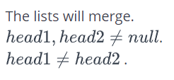

# Зад 2.

## Find Merge Point of Two Lists

###### *This challenge is part of a tutorial track by [MyCodeSchool](https://www.youtube.com/user/mycodeschool)*

Given pointers to the head nodes of **2** linked lists that merge together at some point, find the node where the two lists merge. The merge point is where both lists point to the same node, i.e. they reference the same memory location. It is guaranteed that the two head nodes will be different, and neither will be NULL. If the lists share a common node, return that node's **_data_** value.

**Note:** After the merge point, both lists will share the same node pointers.

**Example**

In the diagram below, the two lists converge at Node `x`:

```
[List #1] a--->b--->c
                     \
                      x--->y--->z--->NULL
                     /
     [List #2] p--->q
```

**Function Description**

Complete the _findMergeNode_ function in the editor below.

_findMergeNode_ has the following parameters:

- _SinglyLinkedListNode_ pointer _head1:_ a reference to the head of the first list
- _SinglyLinkedListNode_ pointer _head2:_ a reference to the head of the second list

**Returns**

_int:_ the **_data_** value of the node where the lists merge

**Input Format**

_Do not read any input from stdin/console._

The first line contains an integer **_t_**, the number of test cases.

Each of the test cases is in the following format:
The first line contains an integer, **_index_**, the node number where the merge will occur.
The next line contains an integer, **_list1 count_** that is the number of nodes in the first list.
Each of the following **_list1 count_** lines contains a  value for a node. The next line contains an integer, **_list2 count_** that is the number of nodes in the second list.
Each of the following **_list1 count_** lines contains a **_data_** value for a node.

**Constraints**



**Sample Input**

The diagrams below are graphical representations of the lists that input nodes **_head1_** and **_head2_** are connected to.

**Test Case 0**

```
 1
  \
   2--->3--->NULL
  /
 1
```

**Test Case 1**

```
1--->2
      \
       3--->Null
      /
     1
```     
**Sample Output**

```
2
3
```

**Explanation**

_Test Case 0:_ As demonstrated in the diagram above, the merge node's data field contains the integer **2**.
_Test Case 1:_ As demonstrated in the diagram above, the merge node's data field contains the integer **3**.
