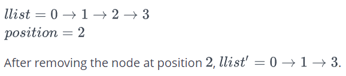
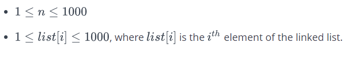

# Зад 3.

## Delete a Node

###### *This challenge is part of a tutorial track by [MyCodeSchool](https://www.youtube.com/user/mycodeschool) and is accompanied by a video lesson.*

Delete the node at a given position in a linked list and return a reference to the head node. The head is at position 0. The list may be empty after you delete the node. In that case, return a null value.

**Example**




**Function Description**

Complete the _deleteNode_ function in the editor below.

_deleteNode_ has the following parameters:
_- SinglyLinkedListNode pointer llist:_ a reference to the head node in the list
_- int position:_ the position of the node to remove

**Returns**

_- SinglyLinkedListNode pointer:_ a reference to the head of the modified list

**Input Format**

The first line of input contains an integer **_n_**, the number of elements in the linked list.
Each of the next **_n_** lines contains an integer, the node data values in order.
The last line contains an integer, **_position_**, the position of the node to delete.

**Constraints**



**Sample Input**

```
8
20
6
2
19
7
4
15
9
3
```

**Sample Output**

```
20 6 2 7 4 15 9
```

Explanation


```c++
#include <bits/stdc++.h>

using namespace std;

string ltrim(const string &);
string rtrim(const string &);

class SinglyLinkedListNode {
    public:
        int data;
        SinglyLinkedListNode *next;

        SinglyLinkedListNode(int node_data) {
            this->data = node_data;
            this->next = nullptr;
        }
};

class SinglyLinkedList {
    public:
        SinglyLinkedListNode *head;
        SinglyLinkedListNode *tail;

        SinglyLinkedList() {
            this->head = nullptr;
            this->tail = nullptr;
        }

        void insert_node(int node_data) {
            SinglyLinkedListNode* node = new SinglyLinkedListNode(node_data);

            if (!this->head) {
                this->head = node;
            } else {
                this->tail->next = node;
            }

            this->tail = node;
        }
};

void print_singly_linked_list(SinglyLinkedListNode* node, string sep, ofstream& fout) {
    while (node) {
        fout << node->data;

        node = node->next;

        if (node) {
            fout << sep;
        }
    }
}

/*
 * Complete the 'deleteNode' function below.
 *
 * The function is expected to return an INTEGER_SINGLY_LINKED_LIST.
 * The function accepts following parameters:
 *  1. INTEGER_SINGLY_LINKED_LIST llist
 *  2. INTEGER position
 */

/*
 * For your reference:
 *
 * SinglyLinkedListNode {
 *     int data;
 *     SinglyLinkedListNode* next;
 * };
 *
 */

SinglyLinkedListNode* deleteNode(SinglyLinkedListNode* llist, int position) {

}

int main()
{
    ofstream fout(getenv("OUTPUT_PATH"));

    SinglyLinkedList* llist = new SinglyLinkedList();

    string llist_count_temp;
    getline(cin, llist_count_temp);

    int llist_count = stoi(ltrim(rtrim(llist_count_temp)));

    for (int i = 0; i < llist_count; i++) {
        string llist_item_temp;
        getline(cin, llist_item_temp);

        int llist_item = stoi(ltrim(rtrim(llist_item_temp)));

        llist->insert_node(llist_item);
    }

    string position_temp;
    getline(cin, position_temp);

    int position = stoi(ltrim(rtrim(position_temp)));

    SinglyLinkedListNode* llist1 = deleteNode(llist->head, position);

    print_singly_linked_list(llist1, " ", fout);
    fout << "\n";

    fout.close();

    return 0;
}

string ltrim(const string &str) {
    string s(str);

    s.erase(
        s.begin(),
        find_if(s.begin(), s.end(), not1(ptr_fun<int, int>(isspace)))
    );

    return s;
}

string rtrim(const string &str) {
    string s(str);

    s.erase(
        find_if(s.rbegin(), s.rend(), not1(ptr_fun<int, int>(isspace))).base(),
        s.end()
    );

    return s;
}
```