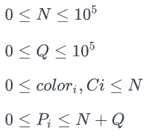

# Зад 5.

## ZUMA

Имате последователност от разноцветни топчета, долепени едно до друго и номерирани с чилата от **_0_** до **_N - 1_**. Можете да изстрелвате топчета с определен цвят към редицата от топчета. Изстреляното топче попада точно след топчето с номер **_P_**, измествайки всички топчета на позиции по-големи от **_P_** с една позиция в дясно. Aко **_P_** e част от последователност от топчета с еднакъв цвят с дължина поне **_3_**, цялата последователност от едноцветни топчета бива унищожена, а лявата и дясната получени последователности се залепят. Ако мястото на залепянето е част от последователност от топчета с еднакъв цвят с дължина поне **_3_**, процедурата се повтаря, в противен случай можете да изстреляте ново топче. Играта прикючва когато не останат топчета в редицата.

От вас се иска да напишете програма която по дадена редица от **_N_** разноцветни топчета, отговаря на **_Q_** на брой заявки. Всяка заявка се състои от две цели числа **_Pi_** и **_Ci_** - номера на топчето, към което трябва да стреляте и цвета на топчето, което изстрелвате. Номера на изстрелятното топче е най-малкото, неизползвано за номер на топче, естествено число. Топчето към което е насочен изстрела винаги съществува (не е унищожено). От вас се иска да намерите броя на унищожените топчета след всеки изстрел. Ако след поредия изстрел не останат никакви топчета, играта приключва и на всяка следваща заявка трябва да отговорите с "Game Over".

След приключване на заявките изведете получената редица от топчета или -1 ако всички топчета са унищожени.

**Input Format**

Първият ред на стандартния вход съдържа едно цяло числа **_N_** - броя топчета.

Вторият ред съдържа **_N_** на брой цели числа **_color1, color2, ... , colorN_** - цветовете на топчетата.

Третият ред съдържа едно цяло числа **_Q_** - броя заявки.

Следват **_Q_** на брой реда сътоящи се от по две цели числа **_Pi_** и **_Ci_** - номера на топчето, към което трябва да стреляте и цвета на топчето, което изстрелвате.

**Constraints**



**Output Format**

Изведете **_Q + 1_** реда.

Първите **_Q_** трябва да съдържат по едно цяло число - отговора на поредната заявка, ако играта е приключила (редицата от топчета е празна) изведете "Game Over".

На последния ред изведете крайното състояние на последователността от топчета, ако в нея не са останали топчета изведете "-1".

**Sample Input 0**

```
15
2 2 1 1 1 2 2 2 2 3 3 3 1 1 2
4
10 3
6 2
1 1
3 2
```

**Sample Output 0**

```
4
13
Game Over
Game Over
-1
```

**Explanation 0**

- След първият изстрел:
  - унищожават се следните 4 топчета: 2 2 1 1 1 2 2 2 2 (3 3 3 3) 1 1 2.
- След вторият изстрел:
  - първо се унищожават следните 5 топчета: 2 2 1 1 1 (2 2 2 2 2) 1 1 2;
  - след което се унищожават следните 5 топчета: 2 2 (1 1 1 1 1) 2;
  - и накрая следните 3 топчета: (2 2 2);
  - общо 13 унищожени топчета.
- Всички топчета са унищожени:
  - Game Over
- Всички топчета са унищожени:
  - Game Over
-Крайното състояние на редицата е празно:
  - -1

**Sample Input 1**

```
6
1 2 2 2 1 1
5
2 3
2 3
2 3
1 5
3 4
```

**Sample Output 1**

```
0
0
9
Game Over
Game Over
-1
```

**Explanation 1**

- След първият изстрел:
  - няма унищожени топчета: 1 2 2 3 2 1 1.
- След вторият изстрел:
  - няма унищожени топчета: 1 2 2 3 3 2 1 1.
- След третият изстрел:
  - първо се унищожават следните 3 топчета: 1 2 2 (3 3 3) 2 1 1;
  - след което се унищожават следните 3 топчета: 1 (2 2 2) 1 1;
  - и накрая следните 3 топчета: (1 1 1);
  - общо 9 унищожени топчета.
- Всички топчета са унищожени:
  - Game Over
- Всички топчета са унищожени:
  - Game Over
- Крайното състояние на редицата е празно:
  - -1

**Sample Input 2**

```
10
1 1 1 2 2 1 1 1 3 3
4
1 4
9 5
9 6
3 2
```

**Sample Output 2**

```
0
0
0
7
1 1 4 3 3 6 5
```

**Explanation 2**

- След първият изстрел:
  - няма унищожени топчета: 1 1 4 1 2 2 1 1 1 3 3.
- След вторият изстрел:
  - няма унищожени топчета: 1 1 4 1 2 2 1 1 1 3 3 5.
- След третият изстрел:
  - няма унищожени топчета: 1 1 4 1 2 2 1 1 1 3 3 6 5.
- След четвъртият изстрел:
  - първо се унищожават следните 3 топчета: 1 1 4 1 (2 2 2) 1 1 1 3 3 6 5;
  - след което се унищожават следните 4 топчета: 1 1 4 (1 1 1 1) 3 3 6 5;
  - общо 7 унищожени топчета.
- Крайното състояние на редицата е:
  - 1 1 4 3 3 6 5

**Sample Input 3**

```
10
1 1 2 2 3 3 4 4 5 5 
10
9 5
4 5
3 6
2 7
5 8
1 9
1 1
3 2
5 3
7 4
```

**Sample Output 3**

```
3
0
0
0
0
0
3
0
0
3
9 2 7 2 2 6 3 5 3 3 8
```